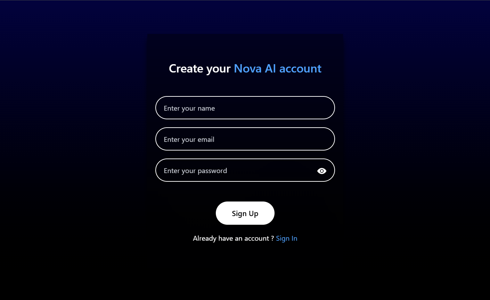
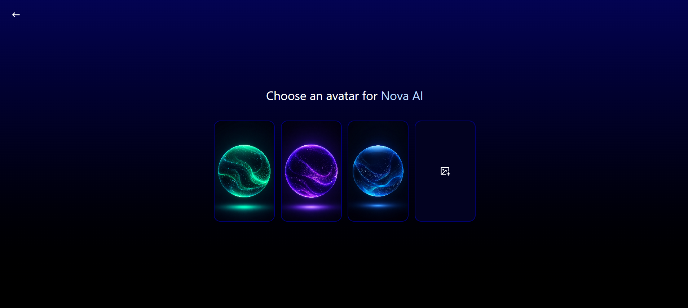
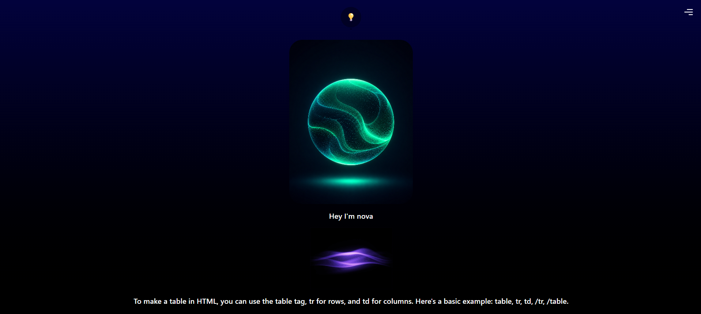
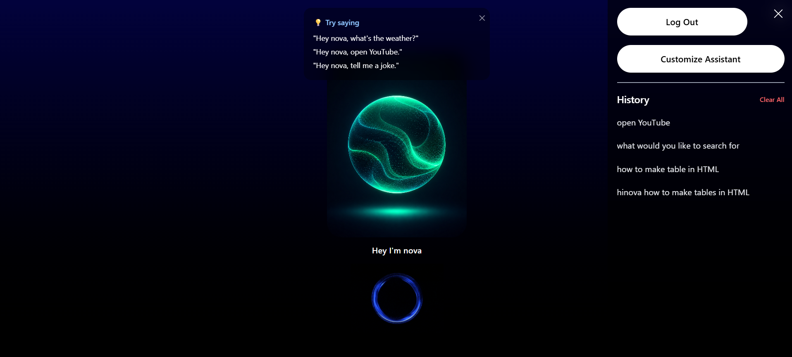

# 🤖 Nova AI — An Intelligent Voice Assistant

Built with the MERN Stack and Groq API. Talk to your own customizable AI assistant — ask questions, get the time/date, search the web, open apps like YouTube, Instagram, and Facebook, check the weather, and more, all through natural voice commands.

## 🚀 Live Demo

🌐 **Live Application:**  
https://nova-ai-mu-eight.vercel.app/

📂 **Source Code:**  
https://github.com/TusharGupta-008/nova-ai

---

## 📸 Screenshots

### Home


### Sign In


### Customize Assistant


### AI Response


### History


---

## ✨ Features

- 🎙️ **Voice-controlled assistant** — powered by the Web Speech API for real-time speech recognition
- 🧠 **AI-powered intent detection** — uses Groq's Llama 3.3 70B model to classify commands and generate responses
- 🔐 **Secure authentication** — JWT-based auth with httpOnly cookies, bcrypt password hashing
- 🎨 **Customizable assistant** — choose a name and avatar image (upload your own or pick a preset)
- ☁️ **Cloud image storage** — uploaded avatars are stored via Cloudinary
- 🕓 **Conversation history** — view and clear your past interactions with the assistant
- ⚡ **Action-based commands** — open YouTube, search Google, check the weather, get the date/time, and more
- 📱 **Fully responsive UI** — consistent experience across mobile, tablet, and desktop

---

## 🛠️ Tech Stack

**Frontend:** React, Tailwind CSS, Axios, React Router
**Backend:** Node.js, Express.js
**Database:** MongoDB with Mongoose
**Auth:** JWT, bcrypt, httpOnly cookies
**AI:** Groq API (Llama 3.3 70B)
**File Storage:** Cloudinary
**Deployment:** Vercel (frontend), Render (backend)

---

## 🏗️ Architecture Overview

```
Client (React)
   │  Web Speech API → voice-to-text
   ▼
Express Backend
   │  JWT auth middleware
   ▼
Groq LLM API → intent classification + response generation
   │
   ▼
MongoDB (user data, assistant settings, history)
   │
   ▼
Cloudinary (assistant avatar images)
```

---

## 🚀 Getting Started Locally

### Prerequisites
- Node.js (v18+ recommended)
- npm
- MongoDB Atlas account (or local MongoDB instance)
- Groq API key
- Cloudinary account (cloud name, API key, API secret)

### 1. Clone the repo
```bash
git clone https://github.com/<your-username>/<your-repo-name>.git
cd <your-repo-name>
```

### 2. Backend setup
```bash
cd backend
npm install
```

Create a `.env` file inside `/backend` with the following variables:

```env
PORT=5000
MONGODB_URI=your_mongodb_connection_string
JWT_SECRET=your_jwt_secret
GROQ_API_KEY=your_groq_api_key
CLOUDINARY_CLOUD_NAME=your_cloudinary_cloud_name
CLOUDINARY_API_KEY=your_cloudinary_api_key
CLOUDINARY_API_SECRET=your_cloudinary_api_secret
```

Run the backend:
```bash
npm run dev
```

### 3. Frontend setup
```bash
cd ../frontend
npm install
```

Create a `.env` file inside `/frontend` with:
```env
VITE_SERVER_URL=http://localhost:5000
```

Run the frontend:
```bash
npm run dev
```

The app will be available at `http://localhost:5173`.

---

## 📂 Project Structure

```
Virtual Assistant/
├── backend/
│   ├── config/          # DB connection, Cloudinary config, JWT token generation
│   ├── controllers/      # Business logic (auth, user, assistant actions)
│   ├── middlewares/      # Auth middleware, Multer upload config
│   ├── models/           # Mongoose schemas
│   ├── routes/           # Express route definitions
│   └── index.js          # App entry point
├── frontend/
│   ├── src/
│   │   ├── assets/       # Images, animations
│   │   ├── components/   # Reusable UI components
│   │   ├── context/      # React Context for global user state
│   │   └── pages/        # Home, SignIn, SignUp, Customize
│   └── vite.config.js
└── README.md
```

---

## 🔒 Security Notes

- Passwords are hashed with bcrypt before storage — never stored in plain text
- JWTs are stored in httpOnly cookies to protect against XSS-based token theft
- Environment variables keep all secrets out of source code

---

## 🧭 Roadmap / Future Improvements

- [ ] Refresh token flow for smoother session expiry handling
- [ ] Rate limiting on authentication and assistant command endpoints
- [ ] Multi-turn conversational context (currently each command is handled independently)
- [ ] WebSocket-based streaming responses for lower perceived latency

---

## 👤 Author

**Tushar Gupta**
GitHub: [@TusharGupta-008](https://github.com/TusharGupta-008)
LinkedIn:  https://www.linkedin.com/in/tushar-gupta-91791627a/

---

## 📄 License

This project is open source and available under the [MIT License](LICENSE).
